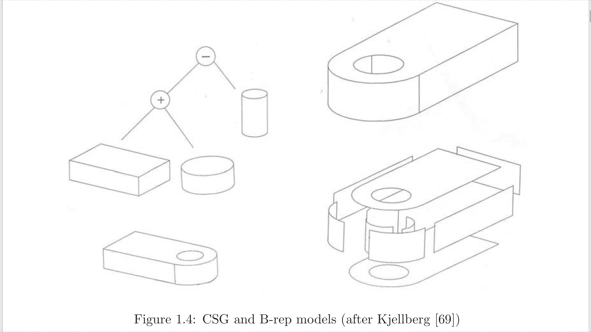

# Research Direction

_Damien Zufferey_

2017.03.02

**3D Printer Demo**

## Hardware and Software Co-design

Rapid prototyping tools ([3D printers](https://formlabs.com/3d-printers/form-2/), [CNC mills](https://www.rolanddga.com/products/3d/mdx-50-benchtop-cnc-mill), ...) give to hardware the flexibility of software.

Currently only dumb object is will soon [print electronics](http://science.sciencemag.org/content/352/6282/205/tab-pdf) as well.
[Voltera One](https://voltera.io/) is already on the list for the hardware lab.

We want software and hardware in the same package and they must interact.
It is about programming objects; both the _shape_ and the _behavior_.

To start, we target simple robots.
Sorry, no (flying) car for the moment...

**Advantages**
- Consistency between the software and hardware parts
- From hardware parameters to software parameters *and the other way around*
- We get to work with some pretty cool pieces of technology.

**Why it is the right time and potential impact (IMO)**
- Many patents related to 3D printing are expiring and the technology is spreading.
- Open source movement has "won" the software battle.
  Open hardware is one of the current/coming battle.
  Academia has a role to play in it.
  There are established industries, but the ground is shifting.
  For instance, Autodesk is giving his software away for free to students and hobbyist in order to keep the professional market and slow down the development of open alternatives.
- Trend toward localization rather than globalization.
  We need new supply chains based around small, local, automated, and universal "factories".
  Current rapid prototyping tools are tomorrow's factories.
  (It is already the case for some CNC machines.)


#### Parts of the Project

1. Objects as programs
2. Dynamic semantics of object
3. Atomic, composable abstractions of continuous evolution

#### People

* Ivan and Aman are working on the direct manipulation for CSG
* Marcus is making a case study (cable robot)
* Anne: atomic actions

&nbsp;

&nbsp;

&nbsp;

&nbsp;

&nbsp;

## Use Case

Code that depends on the geometry: (inverse) kinematics

**Content Warning:** if you believe in good software engineering, you should close your eyes for the next few minutes.

The [Marlin Firmware](https://github.com/MarlinFirmware/Marlin) is used in most ≤3000€ FFF 3D printers.
Let's look at the [Configuration.h](https://github.com/MarlinFirmware/Marlin/blob/RC/Marlin/Configuration.h).

**Types of kinematics:**

* *Cartesian*

* *CoreXY*

  

  [Video Example](https://youtu.be/8SJ8TAvQJR0?t=4m20s)

* *Delta*

  

  [Video Example](https://www.youtube.com/watch?v=H9Al873W3LY)

* *Scara*

  

  [Video Example](https://www.youtube.com/watch?v=R_AIzCTYBNs)

How is that done in the code?

https://github.com/MarlinFirmware/Marlin/blob/RC/Marlin/Marlin_main.cpp (search DELTA, SCARA)

https://github.com/MarlinFirmware/Marlin/blob/RC/Marlin/planner.cpp (CoreXY)

&nbsp;

&nbsp;

&nbsp;

&nbsp;

&nbsp;


## Thinking about Objects as Programs

#### Starting assumptions
- Most engineered objects have structure and programs are good at capturing structure.
- Direct manipulation of objects more intuitive

#### Research question
- How to do both at the same time in a _good_ way?

#### Core language
- Constructive Solid Geometry (CSG)
  * Primitive volume: `Cube`, `Sphere`, `Cylinder`, ...
  * Boolean operation: `∩`, `∪`, `∖`
  * Transformation: `move`, `rotate`, `scale`, `mirror`, ...
  * More: `Minkowski sum`, `convex hull`, ...
- Programming language
  * Values, variables, ...
  * Function Call, ...
  * Control structure: for loops, if statement, ...

#### Demo

Let's make an example with [OpenSCAD](http://www.openscad.org/).

And the same with [FreeCAD](http://www.openscad.org/).

Another example with more control structures.

#### Direct manipulation

Modify the program by modifying the output.

The program structures encodes the constraints defining what is a valid object.

Control structures make the work interesting.
When you change an object in a loop, you potentially affect all the elements generated by the loop.

#### Representation (and semantics)

For the semantics objects are just sets in ℝ³.
The PL part is standard.
The execution of the program generates a CSG tree.
Evaluating that tree generates the object.

Primitive objects are meshes.
(Round shapes are tessellated.)
The boolean operations works on meshes (already implemented in external libraries).

&nbsp;

_Or is it?_  CSG vs Boudary-representation



B-rep is based on topology:
- _Vertices_ are the boundaries of _Edges_
- _Edges_ are the boundaries of _Faces_
- _Faces_ are the boundaries of _Volumes_

Most professional CAD software uses B-rep and NURBS for edges and faces.
It is more flexible (allow to manipulate features).
Not clear how to procedurally refer to the features.

Do an example with FreeCAD.

&nbsp;

&nbsp;

&nbsp;

&nbsp;

&nbsp;

## Bring the Static World and the Dynamic World Together

* Adding joints to the language
  - kind: revolute (rotation), prismatic (translation), ball, planar, ...
  - _top-down_: specify abstract joints and then concretize
  - _bottom-up_: directly include parts that have semantics (motor = revolute join)
* Control algorithms
  - [magic numbers](https://github.com/MarlinFirmware/Marlin/blob/RC/Marlin/speed_lookuptable.h): automate their generation and update?
* State-machines to describe behaviors
  - either as classical software
  - or from controller synthesis (to please the LTL aficionados)

**fist step**
- Share limited set of numerical parameters (Marlin example: min/max of the axis)
- Generation of magic numbers
- ...

&nbsp;

&nbsp;

&nbsp;

&nbsp;

&nbsp;

## Composable Atomic Actions

#### Goal
1. Abstracting complex continuous/hybrid behaviors by atomic actions.
2. Composing discrete events to create new discrete events while preserving some properties, e.g., composing events in a safe way.

#### Example
1. Motion primitive: `move from A to B` as a single action
2. Platooning: multiple robots moving in formation

#### How it is done
1. some expert builds a robot
2. another expert looks at the robot, implements the controller for some action, and exposes it through an API.
However, that does not scale well (expert in the loop).

#### What we want to do

Under which condition can we do the platooning using atomic motion primitives on each individual robot?

#### Running example


makes


Does not make coffee but [builds your furniture](https://www.youtube.com/watch?v=B9sYogRVF8Q)

&nbsp;

Composing resources and action with assume guarantee reasoning:
- The platform can move
- The arm can grasp
- The composed system can fetch

&nbsp;

&nbsp;

&nbsp;

&nbsp;

&nbsp;

## Challenges

* Practical value vs scientific value:
  - Lot of system building effort at the start
  - How to motivate single components in isolation
* Stretching between communities but belonging to neither
  - Not classical PL/V, not robotic either
* Not starting a few men crusade against established fields
  - Software product lines
  - Model-based development
  - CAD tool exposes truly parametric modeling if you dig deep enough...
* ...

&nbsp;

&nbsp;

&nbsp;

&nbsp;

&nbsp;

```
                    -------------------------------
                    | look at me still talking    |
                    | when there's Science to do. |
                    -------------------------------
```

&nbsp;

&nbsp;

&nbsp;
